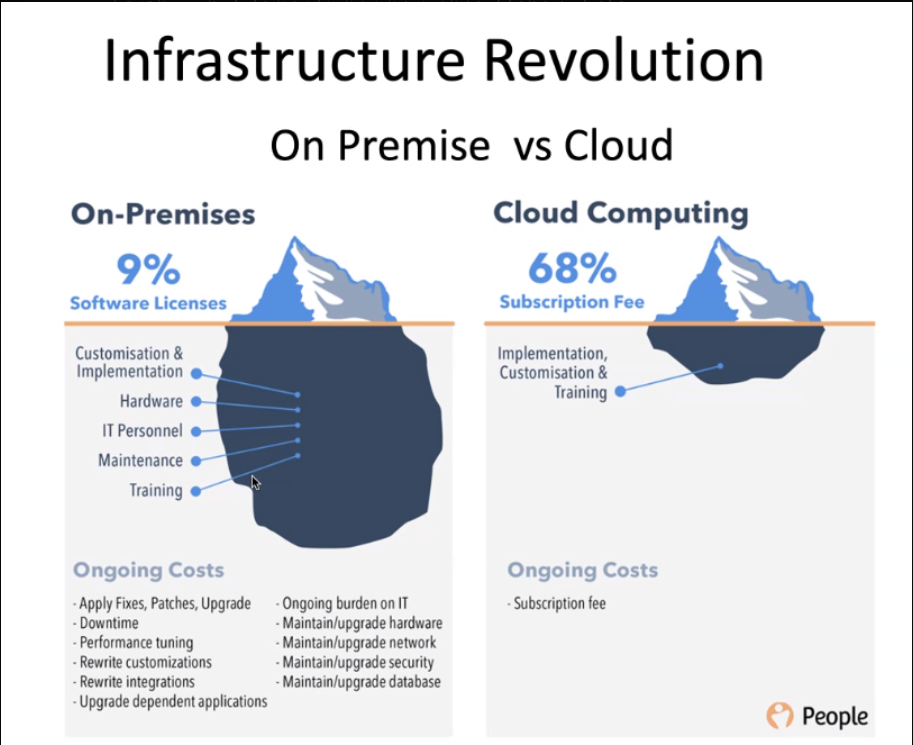

# DevOps

## History of Devs/Opps/Infastructure 

## Modern SW Dev:
- P/I/SaaS 

__DevOps__ is a culture where you want to automate and doing it better
- CI/CD pipielines
- Continious Testing
- Standardized environments
- low costs
- hanndling peaks and growth

__Companies with strong devops culture largely outperform their competitors.__

## Four Pillars of DevOps
- ease 
- flexibility
- robustness
- cost

## Infastructure

## What is DevOps

## Stages in DevOps Lifecycle

## DevOps Implementation

## Risk Register

## What a DevOps Engineer Does?
