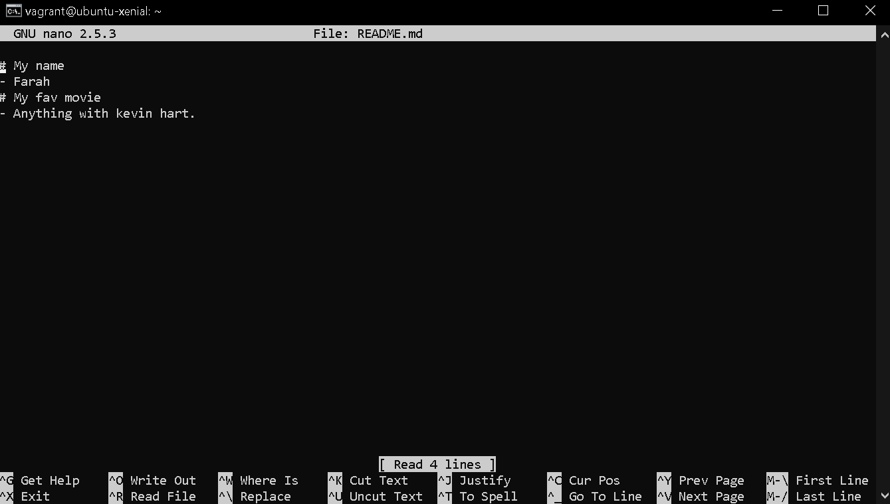

# First Virtual Box, Vagrant Dev Environment
This repo is our first virtual environment to create a dev environment

## Vritual Box - What is it? 

## Vagrant - What is it? 

Vagrant boxes - pre loaded vagrant files that create virtual machines, Usually just an OS.
Ubunto - is an open source OS

Ubunto with GUI - looks like desktop and works like one .

Ubundo headless - is basically a terminal, no GUI.
    - Faster
    - more secure
    - lighter
### Main Commands

- vagrant up with ubunto/xenial64
- vagrant destroy
- delete your vagrant file
- use vagrant init to create vagrant file with centos 7
- vagrant up again
- vagrant destroy

** Note the machines being created in virtual box

### Task 2:
- Create a vagrant box with ubunto version 18.04
    -   `config.vm.box = "bento/ubuntu-10.04"`
- find the command to SSH into the meachine
    - vagrant SSH
- create a README.md file inside the machine and write your name and your movie
